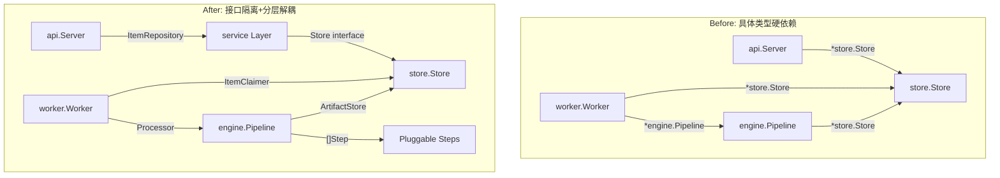

# Go 后端架构重构执行计划

## 现状与目标

当前代码约 1,642 行，分层结构清晰但缺少关键接口抽象，导致各层紧耦合、不可测试。Tech Spec（[docs/02-Tech-Spec.md](docs/02-Tech-Spec.md)）中设计了 `PipelineStep` 接口但实际未实现。

**重构目标**：高内聚低耦合 + KISS + 可测试 + 可扩展




---

## Phase 1: 接口抽象与依赖倒置 (Critical)

这是整个重构的基础，解决 Review 中 Critical #1 #2 #3 问题。

### 1.1 Store 接口化

在 [internal/store/store.go](internal/store/store.go) 中提取接口，按使用方拆分：

```go
// internal/store/interfaces.go (新增文件)
type ItemReader interface {
    GetItem(ctx context.Context, id string) (*model.ItemWithArtifacts, error)
    ListItems(ctx context.Context, f model.ItemFilter) ([]model.Item, error)
}
type ItemWriter interface {
    CreateItem(ctx context.Context, item model.Item) error
    UpdateItemStatus(ctx context.Context, id, newStatus string, errorInfo *string) error
    UpdateItemScoreAndPriority(ctx context.Context, id string, score float64, priority string) error
}
type ItemClaimer interface {
    ClaimNextCaptured(ctx context.Context) (*model.Item, error)
    ResetStaleProcessing(ctx context.Context) (int64, error)
}
type ArtifactStore interface {
    UpsertArtifact(ctx context.Context, a model.Artifact) error
}
```

- 所有方法签名统一加入 `context.Context` 第一参数
- 实现层改用 `db.ExecContext` / `db.QueryContext` / `db.QueryRowContext`
- `Store` struct 同时实现所有接口

### 1.2 Pipeline 接口化

在 [internal/worker/worker.go](internal/worker/worker.go) 中定义 Worker 所依赖的 Pipeline 接口：

```go
// internal/worker/worker.go
type Processor interface {
    Run(ctx context.Context, item *model.Item) error
}
```

Worker 的 `pipeline` 字段类型从 `*engine.Pipeline` 改为 `Processor`。

### 1.3 Engine 层解除对 Store 的直接依赖

当前 [internal/engine/pipeline.go](internal/engine/pipeline.go) 直接 import `store` 包。重构后 Pipeline 只依赖 `ArtifactStore` 接口（定义在 engine 包内）：

```go
// internal/engine/pipeline.go
type Pipeline struct {
    artifacts ArtifactStore  // 接口，不再是 *store.Store
    extractor ContentExtractor
    model     ModelClient
}
```

### 1.4 更新 main.go 装配

[cmd/server/main.go](cmd/server/main.go) 作为 composition root，负责将 `store.Store` 注入到各层。

**验收标准**：

- `engine` 包不再 import `store` 包
- `worker` 包不再 import `engine` 包（只依赖 `Processor` 接口）
- `api` 包不再 import `store` 包（只依赖接口）
- `go vet ./...` 通过
- 服务正常启动并可处理 capture 请求

---

## Phase 2: Pipeline Step 可插拔化 (Suggestion)

对应 Review #6 和 Tech Spec 中未实现的 `PipelineStep` 接口设计。

### 2.1 定义 Step 接口

在 [internal/engine/interfaces.go](internal/engine/interfaces.go) 中新增：

```go
type StepContext struct {
    Item       *model.Item
    Extraction *ExtractedContent  // Step 1 产出
    Summary    *SummaryResult     // Step 2 产出
    Score      *ScoreResult       // Step 3 产出
    Todos      *TodosResult       // Step 4 产出
}

type Step interface {
    Name() string
    Run(ctx context.Context, sc *StepContext) error
}
```

### 2.2 重构 Pipeline 为 Step 编排器

```go
type Pipeline struct {
    artifacts ArtifactStore
    steps     []Step
}

func (p *Pipeline) Run(ctx context.Context, item *model.Item) error {
    sc := &StepContext{Item: item}
    for _, step := range p.steps {
        if err := step.Run(ctx, sc); err != nil {
            return &StepError{Step: step.Name(), Err: err}
        }
    }
    return nil
}
```

### 2.3 将现有 4 个步骤实现为 Step

把 [internal/engine/steps.go](internal/engine/steps.go) 中的 4 个方法拆为独立 struct，每个实现 `Step` 接口。消除重复代码，LLM 类步骤可复用泛型辅助函数。

**验收标准**：

- `Pipeline.steps` 为 `[]Step`，可通过构造函数注入
- 现有 4 步行为不变
- 新增一个 Step 只需实现接口 + 注册，无需改 Pipeline 核心

---

## Phase 3: Service 层抽取 + 健壮性加固 (Suggestion)

对应 Review #5 #8 #9 #10 #11。

### 3.1 新增 Service 层

创建 `internal/service/item_service.go`：

- 将 [internal/api/handlers.go](internal/api/handlers.go) 中的状态转换验证逻辑下沉到 Service
- 或更轻量地在 `model.Item` 上增加 `CanTransitionTo(target string) error` 方法
- Handler 只做 HTTP 解析 + 调用 Service + 返回响应

### 3.2 错误处理改进

- 全局替换 `err == sql.ErrNoRows` 为 `errors.Is(err, sql.ErrNoRows)`
- `json.Marshal` 错误不再用 `_` 忽略，至少 log
- OpenAI 重试加入 `time.Sleep` 退避 + 区分可重试/不可重试错误

### 3.3 安全加固

- Handler 中 `r.Body` 统一用 `http.MaxBytesReader(w, r.Body, 1<<20)` 限制 1MB
- `truncate()` 函数改为 rune-safe 实现
- CORS origin 改为可配置（环境变量），默认 `*` 保留但加 TODO 注释

### 3.4 日志升级

- 引入 `log/slog`（Go 1.21+ 标准库），替换所有 `log.Printf`
- 结构化字段：`slog.String("item_id", id)` 等

**验收标准**：

- Handler 函数不超过 30 行（纯 HTTP 胶水）
- `errors.Is` 替代 `==` 比较
- 请求体有大小限制
- 日志为结构化 JSON 格式

---

## Phase 4: 配置管理与杂项 (Nice to Have)

### 4.1 统一配置

创建 `internal/config/config.go`，收拢散落的硬编码值：

```go
type Config struct {
    Port            string
    DBPath          string
    OpenAIKey       string
    OpenAIModel     string
    WorkerInterval  time.Duration
    HTTPTimeout     time.Duration
    MaxTextLength   int
}
```

从环境变量加载，`main.go` 只做 `cfg := config.Load()`。

### 4.2 修正 go.mod

`go 1.25.5` 改为实际使用的 Go 版本（如 `go 1.23`）。

### 4.3 数据库迁移预留

在 `migrate()` 中加入版本号机制，为后续 schema 变更预留能力。

**验收标准**：

- 硬编码常量（超时、间隔、限制）集中在 Config
- `go.mod` 版本号合法
- 所有环境变量有文档说明

---

## Phase 5: 提炼 Cursor Rules

将本次重构中确立的架构规范固化为 `.cursor/rules/`，指导后续开发：

### 5.1 Go 架构规范 Rule

文件：`.cursor/rules/go-architecture.mdc`

覆盖内容：

- 分层规则（api / service / engine / store / model）
- 依赖方向：外层依赖内层，接口定义在使用方
- Context 传递规范
- 错误处理惯例（errors.Is/As、不忽略错误、自定义错误类型）
- 接口设计原则（小接口、ISP）

### 5.2 Go 代码风格 Rule

文件：`.cursor/rules/go-style.mdc`

覆盖内容：

- 标准库优先（net/http, log/slog）
- 函数不超过 50 行
- 命名约定
- 结构化日志格式
- 测试文件命名与组织

**验收标准**：

- Rules 可被 Cursor AI 在后续开发中自动引用
- 新增代码遵循规范

---

## 风险与注意事项

- Phase 1 改动面最大（几乎所有文件），需要一次性完成并验证编译通过
- Phase 2 改变了 Pipeline 的执行模型，需仔细保证行为不变
- 当前 0% 测试覆盖，重构期间以"编译通过 + 手动端到端测试"为验收底线
- 建议每个 Phase 完成后做一次 commit，方便回滚

