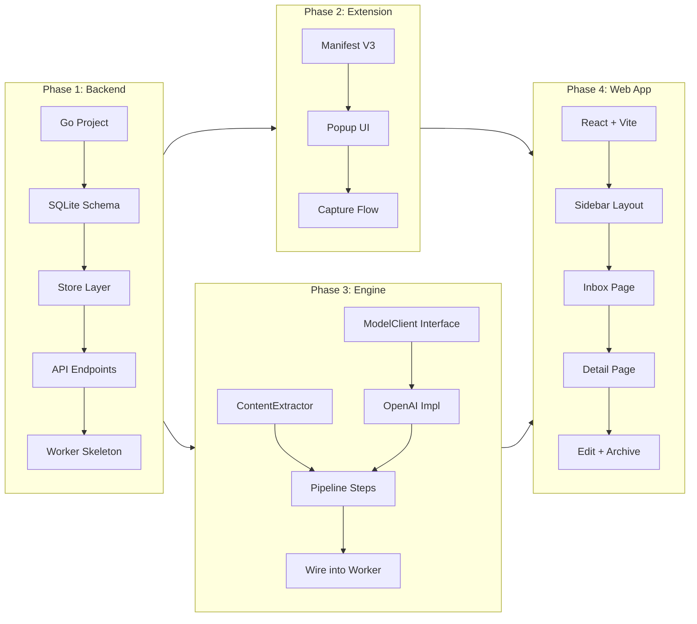
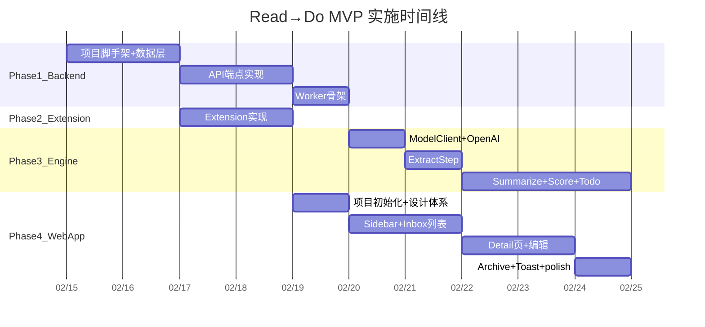

# Read→Do MVP 执行计划

## 架构全景




Phase 2 和 Phase 3 可并行开发。Phase 4 在 API 就绪后即可启动，Pipeline 完成后补全真实数据展示。

---

## Phase 1: Backend 基座（API + 数据层 + Worker 骨架）

**目标**：搭建完整的 Go 后端，所有 API 可调用，Worker 能轮询处理任务。

### 1.1 项目脚手架

按 [02-Tech-Spec.md](docs/02-Tech-Spec.md) Section 4 的目录结构初始化：

```
readdo/
├── cmd/server/main.go       # 入口
├── internal/
│   ├── api/                  # HTTP handlers
│   ├── engine/               # Core Engine (Phase 3 填充)
│   ├── model/                # 领域模型
│   ├── store/                # SQLite 数据访问
│   └── worker/               # Worker
├── go.mod
└── go.sum
```

- `go mod init github.com/yangwenmai/readdo`
- 引入依赖：HTTP router（chi 或 标准库 net/http）、SQLite driver（modernc.org/sqlite）、UUID 生成

### 1.2 数据模型 + SQLite

在 `internal/model/` 定义结构体，在 `internal/store/` 实现数据访问：

- **Item 结构体**：对应 [02-Tech-Spec.md](docs/02-Tech-Spec.md) Section 5.1 的 items 表
- **Artifact 结构体**：对应 Section 5.2 的 artifacts 表
- SQLite 初始化：自动建表（embedded SQL），参考 Tech Spec 的 CREATE TABLE 语句
- Store 接口方法：
  - `CreateItem(item) -> item`
  - `GetItem(id) -> item + artifacts`
  - `ListItems(filters) -> []item`
  - `UpdateItemStatus(id, newStatus) -> error`
  - `UpsertArtifact(artifact) -> error`
  - `ClaimNextCaptured() -> item`（原子更新 CAPTURED→PROCESSING）

### 1.3 API 端点

在 `internal/api/` 实现 6 个端点（对应 [02-Tech-Spec.md](docs/02-Tech-Spec.md) Section 8）：


| Method | Path                           | 核心逻辑                                       |
| ------ | ------------------------------ | ------------------------------------------ |
| POST   | /api/capture                   | 校验输入 → CreateItem(CAPTURED) → 返回 item_id   |
| GET    | /api/items                     | 解析 query params → ListItems → 返回列表         |
| GET    | /api/items/:id                 | GetItem → 返回 item + artifacts              |
| POST   | /api/items/:id/retry           | 校验 FAILED → 清除 error_info → 置为 CAPTURED    |
| PATCH  | /api/items/:id/status          | 校验状态合法性 → UpdateItemStatus                 |
| PUT    | /api/items/:id/artifacts/:type | 校验 READY → UpsertArtifact(created_by=user) |


全局中间件：CORS（允许 Extension origin + localhost）、JSON Content-Type、错误处理。

### 1.4 Worker 骨架

在 `internal/worker/` 实现轮询循环：

```go
// 伪代码
for {
    item := store.ClaimNextCaptured()  // 原子 CAPTURED→PROCESSING
    if item == nil { sleep(3s); continue }
    err := engine.RunPipeline(ctx, item)  // Phase 3 实现
    if err != nil {
        store.UpdateItemStatus(item.ID, "FAILED", errorInfo)
    } else {
        store.UpdateItemStatus(item.ID, "READY")
    }
}
```

Phase 1 中 `engine.RunPipeline` 先用 stub（直接返回 mock artifacts），确保 CAPTURED→READY 流程跑通。

### 1.5 启动入口

`cmd/server/main.go`：初始化 SQLite → 注册路由 → 启动 Worker goroutine → 启动 HTTP server。

服务重启时将残留 PROCESSING 状态重置为 CAPTURED。

---

## Phase 2: Chrome Extension

**目标**：一键 Capture + intent 输入，3 秒内完成。

### 2.1 项目结构

```
extension/
├── manifest.json       # Manifest V3
├── popup.html          # Popup 页面
├── popup.css           # 样式
├── popup.js            # 逻辑
└── icons/              # 图标（16/48/128）
```

### 2.2 manifest.json

- Manifest V3，permissions: `activeTab`、`tabs`
- action.default_popup: `popup.html`
- host_permissions: `http://localhost:*/*`（访问本地 API）

### 2.3 Popup 实现

对照 [01-UX-Spec.md](docs/01-UX-Spec.md) Section 3 的设计：

- **打开时**：`chrome.tabs.query` 获取当前 tab 的 url + title，展示在只读区域
- **自动提取 domain**：从 URL 解析
- **Intent 输入框**：自动聚焦，placeholder "Why save this?"
- **Save 按钮**：POST `/api/capture` 发送 `{url, title, domain, source_type, intent_text}`
- **状态切换**：
  - Saving → 按钮 disabled + spinner
  - Success → 切换成功画面（绿色对勾 + "Safe to close this tab." + "Open Inbox" 链接）
  - Error → 红色 toast + Retry

### 2.4 source_type 推断

简单规则：URL 包含 `youtube.com` → youtube，包含 `substack.com` 等 → newsletter，其余 → web。

---

## Phase 3: Core Engine（Pipeline）

**目标**：实现 Extract → Summarize → Score → Todo 四步 pipeline，接入 OpenAI。

### 3.1 接口定义

在 `internal/engine/` 定义核心接口（对应 [02-Tech-Spec.md](docs/02-Tech-Spec.md) Section 7.2）：

```go
type PipelineStep interface {
    Name() string
    Run(ctx context.Context, input StepInput) (StepOutput, error)
}

type ModelClient interface {
    Complete(ctx context.Context, prompt string) (string, error)
}

type ContentExtractor interface {
    Extract(ctx context.Context, url string) (*ExtractedContent, error)
}
```

### 3.2 ModelClient + OpenAI 实现

- 定义 `ModelClient` 接口在 `internal/engine/model.go`
- OpenAI 实现在 `internal/engine/openai.go`：调用 Chat Completions API，支持配置 model name（默认 gpt-4o-mini）
- API Key 从环境变量 `OPENAI_API_KEY` 读取
- 超时、重试（1 次）、错误包装

### 3.3 ExtractStep

- HTTP GET 获取页面 HTML
- 使用 go-readability 提取正文（`go.mozilla.org/readability` 或类似库）
- 规范化：去多余空白、限制 ~15k 字符
- 输出 extraction artifact：`{normalized_text, content_meta: {author, publish_date, word_count}}`

### 3.4 SummarizeStep

- 输入：normalized_text + intent_text
- Prompt 模板：要求输出 JSON `{bullets: string[3], insight: string}`
- 调用 ModelClient.Complete → 解析 JSON → 写入 summary artifact

### 3.5 ScoreStep

- 输入：intent_text + summary + content_meta
- Prompt 模板：要求输出 JSON `{match_score: 0-100, priority: enum, reasons: string[>=3]}`
- 评分维度指引：intent 匹配度、信息密度、新颖度、投入产出比
- 写入 score artifact，同步更新 `items.priority` 和 `items.match_score`

### 3.6 TodoStep

- 输入：intent_text + summary + priority
- Prompt 模板：要求输出 JSON `{todos: [{title, eta, type}]}`，约束 3-7 条，动词开头，至少 1 条输出型
- 写入 todos artifact

### 3.7 Pipeline 串联

```go
func RunPipeline(ctx, item, extractor, model, store) error {
    // Step 1: Extract
    extraction, err := extractStep.Run(ctx, item)
    store.UpsertArtifact("extraction", extraction)

    // Step 2: Summarize
    summary, err := summarizeStep.Run(ctx, extraction, item.IntentText)
    store.UpsertArtifact("summary", summary)

    // Step 3: Score
    score, err := scoreStep.Run(ctx, item.IntentText, summary, extraction.Meta)
    store.UpsertArtifact("score", score)
    store.UpdateItemScoreAndPriority(item.ID, score)

    // Step 4: Todo
    todos, err := todoStep.Run(ctx, item.IntentText, summary, score.Priority)
    store.UpsertArtifact("todos", todos)

    return nil  // 任一步 err != nil 则提前返回
}
```

---

## Phase 4: Web App

**目标**：实现 Inbox 决策队列 + 详情编辑，对照 [01-UX-Spec.md](docs/01-UX-Spec.md) 的视觉规格。

### 4.1 项目初始化

```
web/
├── index.html
├── package.json
├── vite.config.ts
├── src/
│   ├── main.tsx
│   ├── App.tsx
│   ├── api/            # API client
│   ├── components/     # 可复用组件
│   ├── pages/          # 页面组件
│   └── styles/         # CSS 变量 / 全局样式
```

- React + TypeScript + Vite
- React Router（Inbox / Archive / Detail）
- CSS 方案：CSS Modules 或 Tailwind CSS

### 4.2 全局样式 + 设计体系

按 [01-UX-Spec.md](docs/01-UX-Spec.md) Section 2 落地 CSS 变量：

- 色彩 token（`--bg-primary`, `--accent`, Priority 语义色等）
- 字体层级（Inter 字体栈，H1/H2/H3/Body/Small/Label）
- 间距系统（4px 基准网格，xs/sm/md/lg/xl）
- 圆角 + 阴影

### 4.3 Sidebar + Layout

- 左侧 200px 固定侧边栏（`--bg-secondary` 背景）
- 导航项：Inbox（带数量 badge）、Archive
- 右侧 Main Content 白色背景
- 768-1199px 时 Sidebar 折叠为 48px 图标模式

### 4.4 Inbox 页

对照 UX Spec Section 4.2：

- **数据获取**：GET /api/items?status=CAPTURED,PROCESSING,READY,FAILED
- **分组展示**：Processing 区域（顶部，骨架屏）→ Read next → Worth it → If time → Skip
- **Item 卡片**：Priority Badge（语义色）+ Score + Title + Domain + Intent（引号样式）+ Reasons（ ✦ 前缀）
- **FAILED 卡片**：红色左边框 + Retry 内联按钮
- **空状态**：图标 + "Inbox is empty" + 引导文案
- **轮询刷新**：每 5 秒检查 PROCESSING 状态是否更新（或后续用 SSE/WebSocket）

### 4.5 Item Detail 页

对照 UX Spec Section 4.3：

- 单列居中（max-width 720px）
- Header：Title（可点击跳转原文）+ Domain + Intent + Priority/Score/Time
- Why Read This：Reasons 列表
- Summary 区块：3 bullets + insight，右上角 Edit 按钮
- Todos 区块：checkbox 列表 + ETA + Total 汇总，支持勾选/Edit/Add
- Actions：Archive 按钮 + Open Original 按钮
- 编辑模式：内容变可编辑 → Save/Cancel → PUT /api/items/:id/artifacts/:type
- 全部 TODO 完成后提示 "All done! Archive this item?"

### 4.6 Archive 页

- 与 Inbox 列表结构一致，卡片透明度略低
- 每条有 "Restore" 操作 → PATCH /api/items/:id/status (READY)
- 按时间倒序

### 4.7 Toast + 状态反馈

- 底部居中 Toast 组件（深色背景、白色文字、1.5s 自动消失）
- 骨架屏组件（PROCESSING 状态）
- 卡片悬停动效（translateY -1px + shadow）

---

## 实施顺序与依赖




**关键路径**：Phase 1 → Phase 3 → Phase 4 完整集成

**可并行**：Phase 2（Extension）在 Phase 1.1 完成后即可启动，与 Phase 3 并行