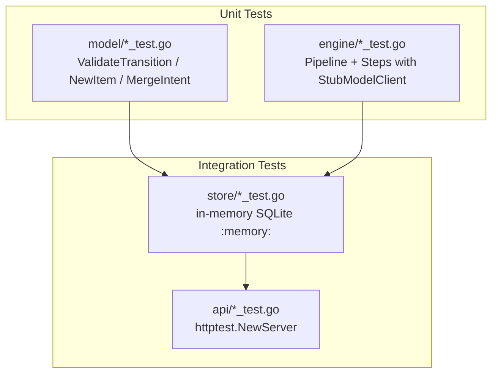

# readdo v0.3 / v0.4 / v0.7 迭代计划

## 一、v0.3 核心体验补全（删除 + 搜索 + 批量操作）

### 1.1 删除功能

**后端改动：**

- [store/interfaces.go](internal/store/interfaces.go)：在 `ItemWriter` 接口中新增 `DeleteItem(ctx context.Context, id string) error`
- [store/store.go](internal/store/store.go)：实现 `DeleteItem` — 使用事务级联删除 `items` + `artifacts` + `intents` 三张表中的相关记录
- [api/handlers.go](internal/api/handlers.go)：新增 `handleDeleteItem` handler，校验 item 存在且状态非 PROCESSING
- [api/server.go](internal/api/server.go)：注册路由 `DELETE /api/items/{id}`

**前端改动：**

- [web/src/api/client.ts](web/src/api/client.ts)：新增 `api.deleteItem(id)`
- [web/src/pages/DetailPage.tsx](web/src/pages/DetailPage.tsx)：Actions 区域新增 "Delete" 按钮（带二次确认 `window.confirm`）

### 1.2 搜索功能

**后端改动：**

- [model/item.go](internal/model/item.go)：`ItemFilter` 新增 `Query string` 字段
- [store/store.go](internal/store/store.go)：`ListItems` 方法中，当 `Query` 非空时追加 `WHERE (title LIKE ? OR domain LIKE ? OR intent_text LIKE ?)` 条件，使用 `%query%` 模式
- [api/handlers.go](internal/api/handlers.go)：`handleListItems` 解析 `?q=` 查询参数，填入 `ItemFilter.Query`

**前端改动：**

- [web/src/pages/InboxPage.tsx](web/src/pages/InboxPage.tsx)：页面顶部新增搜索输入框，输入后追加 `&q=` 参数请求 API（防抖 300ms）
- [web/src/api/client.ts](web/src/api/client.ts)：`listItems` 方法新增可选 `query` 参数
- [web/src/pages/ArchivePage.tsx](web/src/pages/ArchivePage.tsx)：同样支持搜索

### 1.3 批量操作

**后端改动：**

- [store/interfaces.go](internal/store/interfaces.go)：`ItemWriter` 新增 `BatchUpdateStatus(ctx, ids []string, status string) (int64, error)` 和 `BatchDeleteItems(ctx, ids []string) (int64, error)`
- [store/store.go](internal/store/store.go)：实现上述两个方法，使用 `WHERE id IN (?)` + 事务
- [api/handlers.go](internal/api/handlers.go)：新增两个 handler：
  - `handleBatchStatus`：`POST /api/items/batch/status` — body: `{"ids": [...], "status": "ARCHIVED"}`
  - `handleBatchDelete`：`POST /api/items/batch/delete` — body: `{"ids": [...]}`
- [api/server.go](internal/api/server.go)：注册上述两条路由

**前端改动：**

- [web/src/api/client.ts](web/src/api/client.ts)：新增 `api.batchStatus(ids, status)` 和 `api.batchDelete(ids)`
- [web/src/pages/InboxPage.tsx](web/src/pages/InboxPage.tsx)：
  - 新增"选择模式"按钮，启用后 ItemCard 显示 checkbox
  - 底部浮动操作栏：显示已选数量 + "Archive selected" / "Delete selected" 按钮
- [web/src/components/ItemCard.tsx](web/src/components/ItemCard.tsx)：新增可选 `selectable` / `selected` / `onToggle` props

---

## 二、v0.4 多模型支持

现有 `ModelClient` 接口（[engine/interfaces.go](internal/engine/interfaces.go) L10-12）只需要实现 `Complete(ctx, prompt) (string, error)`，扩展非常方便。

### 2.1 配置层

- [config/config.go](internal/config/config.go)：新增字段：
  - `LLMProvider string`：从 `LLM_PROVIDER` 读取，默认 `"openai"`，可选 `"claude"` / `"gemini"` / `"ollama"`
  - `AnthropicKey string`：从 `ANTHROPIC_API_KEY` 读取
  - `GeminiKey string`：从 `GEMINI_API_KEY` 读取
  - `OllamaURL string`：从 `OLLAMA_URL` 读取，默认 `"http://localhost:11434"`
  - `OllamaModel string`：从 `OLLAMA_MODEL` 读取，默认 `"llama3"`
  - 调整 `UseStubs()` 逻辑：当所有 key 都为空时返回 true

### 2.2 新增 ModelClient 实现

创建三个新文件，均在 `internal/engine/` 下：

- `**claude.go`**：`ClaudeClient` 实现，调用 Anthropic Messages API (`https://api.anthropic.com/v1/messages`)，使用 `anthropic-version: 2023-06-01` header
- `**gemini.go`**：`GeminiClient` 实现，调用 Google Generative AI REST API (`https://generativelanguage.googleapis.com/v1beta/models/{model}:generateContent`)
- `**ollama.go`**：`OllamaClient` 实现，调用本地 Ollama API (`{base_url}/api/generate`)，支持 Llama/Qwen/DeepSeek 等模型

每个实现遵循与现有 `OpenAIClient` 相同的模式：

- 支持通过 Option 函数配置模型名
- 自动重试一次（transient errors）
- Temperature 0.3

### 2.3 入口适配

- [cmd/server/main.go](cmd/server/main.go)：将现有的 OpenAI 硬编码逻辑替换为基于 `cfg.LLMProvider` 的 switch 分发：

```go
switch cfg.LLMProvider {
case "claude":
    modelClient = engine.NewClaudeClient(cfg.AnthropicKey, ...)
case "gemini":
    modelClient = engine.NewGeminiClient(cfg.GeminiKey, ...)
case "ollama":
    modelClient = engine.NewOllamaClient(cfg.OllamaURL, ...)
default:
    modelClient = engine.NewOpenAIClient(cfg.OpenAIKey, ...)
}
```

---

## 三、v0.7 测试覆盖 + CI

### 3.1 测试策略




- `**internal/model/item_test.go**`：测试状态转换 `ValidateTransition`（合法/非法转换）、`NewItem` 默认值、`MergeIntent` 逻辑
- `**internal/store/store_test.go**`：使用 `sql.Open("sqlite", ":memory:")` 创建内存数据库，测试 CRUD / `ClaimNextCaptured` / `FindItemByURL` / 迁移逻辑 / 新增的 Delete/Search/Batch 方法
- `**internal/engine/pipeline_test.go**`：使用 `StubModelClient` + mock `ArtifactStore` 测试 Pipeline 全流程、单步失败包装为 StepError
- `**internal/engine/steps_test.go**`：测试各 Step 的 Run 方法，验证 artifact 被正确持久化
- `**internal/api/handlers_test.go**`：使用 `httptest` + 内存 Store 测试各 HTTP handler 的 status code、response body、边界条件

### 3.2 GitHub Actions CI

新建 `.github/workflows/ci.yml`：

```yaml
name: CI
on: [push, pull_request]
jobs:
  test:
    runs-on: ubuntu-latest
    steps:
      - uses: actions/checkout@v4
      - uses: actions/setup-go@v5
        with:
          go-version-file: go.mod
      - run: go vet ./...
      - run: go test -race -coverprofile=coverage.out ./...
      - uses: actions/setup-node@v4
        with:
          node-version: 20
      - run: cd web && npm ci && npx tsc --noEmit
```

---

## 实施顺序

建议按以下顺序推进，每完成一个阶段可单独提交/合并：

1. **Phase 1 - 测试基础设施**（v0.7 部分）：先写 model + store + engine 的测试，为后续改动建立安全网
2. **Phase 2 - 删除 + 搜索**（v0.3 部分）：后端 + 前端 + 对应测试
3. **Phase 3 - 批量操作**（v0.3 部分）：后端 + 前端 + 对应测试
4. **Phase 4 - 多模型支持**（v0.4）：新增 3 个 ModelClient + config + main.go 适配 + 对应测试
5. **Phase 5 - CI**（v0.7 部分）：GitHub Actions workflow + API handler tests

